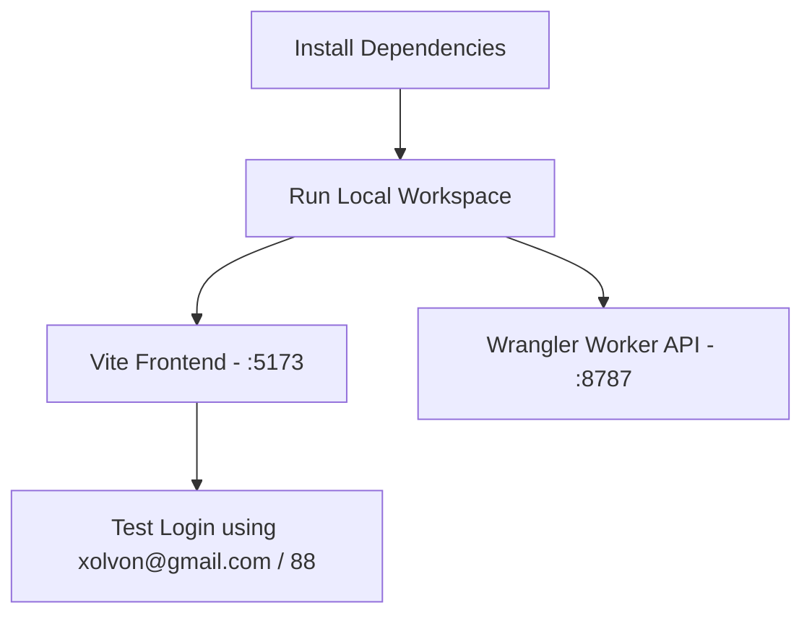
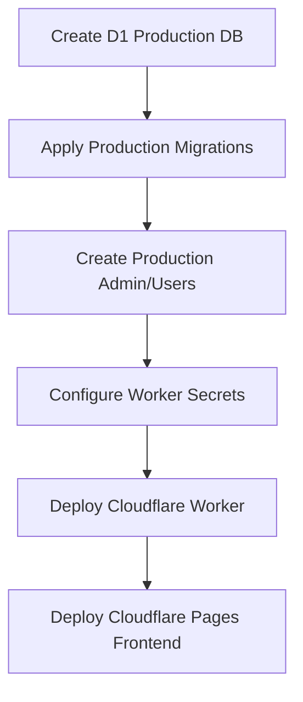

# 🚜 xfarming: Finishing & Deployment Guide

This guide outlines the completed database tasks and provides a premium, production-ready, step-by-step roadmap to fully configure, run, and deploy the unified content factory (**Hero Video**, **Trendline**, and **XFarm**).

---

## 🛠️ What We Have Configured for You

We have successfully performed the following configurations in your workspace so you can start testing immediately:

1. **Password Length Validation Lowered**
   - Modified `packages/shared/src/schemas.ts` to allow a password minimum length of **`2` characters** (instead of `8`), making your requested password `"88"` valid across both the frontend and backend schemas.
2. **Local Database Initialized**
   - Applied D1 migrations locally in the API worker to establish the `users` and `jobs` tables.
3. **Pre-created Account `xolvon` (Bypass Paywall)**
   - Generated a standards-compliant PBKDF2 hash of your password `"88"`.
   - Inserted **two pre-active accounts** into the local D1 database:
     * **Email:** `xolvon@gmail.com` | **Password:** `88` | **Status:** `active`
     * **Email:** `xolvon@xfarming.com` | **Password:** `88` | **Status:** `active`
   - Setting the status to `active` ensures you instantly bypass the QRIS payment screen and can utilize the content generation suites immediately.
4. **Local Configuration Files Populated**
   - Created `apps/api/.dev.vars` with local JWT and R2 mock configurations.
   - Created `apps/web/.env` with the default admin WhatsApp contact variable.

---

## 🚀 Step-by-Step Walkthrough

### Phase 1: Local Development & Testing

Follow these steps to spin up the local development servers and test the login with your new account:



#### 1. Install Workspace Dependencies
Make sure you are in the `xfarming` root folder and run:
```bash
pnpm install
```

#### 2. Run Local Development Servers
To boot up both the React frontend and the Cloudflare API Worker concurrently, run:
```bash
pnpm dev
```
* **Frontend UI:** [http://localhost:5173](http://localhost:5173)
* **API Worker:** [http://localhost:8787](http://localhost:8787) (Vite proxies all `/api/*` traffic here automatically)

#### 3. Perform Test Login
1. Open your browser and navigate to `http://localhost:5173`.
2. Go to the login page and enter:
   - **Email:** `xolvon@gmail.com` (or `xolvon@xfarming.com`)
   - **Password:** `88`
3. Upon clicking **Login**, a secure HTTP-Only session cookie will be saved, and your status will resolve as `active`, opening the dashboard seamlessly!

---

### Phase 2: Cloudflare Production Setup & Deployment

Once local testing is complete, proceed with the production infrastructure setup:



#### 1. Production D1 Database Creation
Run this command from your command-line (requires Cloudflare CLI login):
```bash
npx wrangler d1 create xfarming
```
> [!IMPORTANT]
> Copy the returned `database_id` value and paste it into `apps/api/wrangler.toml` inside the `[[d1_databases]]` section:
> ```toml
> database_id = "YOUR_NEW_PRODUCTION_DATABASE_ID"
> ```

#### 2. Run Production Database Migrations
Execute the migrations against the remote Cloudflare D1 environment:
```bash
npx wrangler d1 migrations apply xfarming --remote
```

#### 3. Create Production Login Credentials
To insert the `xolvon` user into the **production D1 database**, execute the SQL insert command directly via Wrangler using the `--remote` flag:
```bash
npx wrangler d1 execute xfarming --remote --command="INSERT OR REPLACE INTO users (id, email, password_hash, status, created_at) VALUES ('xolvon_prod', 'xolvon@gmail.com', '798IgYgXoFsz8jF19JYeXw==.wS+Ws878suK/GuQV0gouwt1tnNlrmAzP6o2cjKLXtvY=', 'active', '2026-05-20T01:46:54.000Z');"
```

#### 4. Configure Production Worker Secrets
Set up the sensitive production variables on the Cloudflare Workers dashboard or command line:
```bash
npx wrangler secret put JWT_SECRET
npx wrangler secret put ADMIN_SECRET
npx wrangler secret put R2_ACCOUNT_ID
npx wrangler secret put R2_ACCESS_KEY_ID
npx wrangler secret put R2_SECRET_ACCESS_KEY
npx wrangler secret put R2_BUCKET_NAME
npx wrangler secret put HF_STUDIO_BASE_URL
npx wrangler secret put HF_XFARM_BASE_URL
```

#### 5. Deploy Cloudflare Worker API
Navigate to the API folder or use filter to publish:
```bash
pnpm --filter @xfarming/api deploy
```

#### 6. Deploy React Frontend to Cloudflare Pages
1. Build the production assets:
   ```bash
   pnpm --filter @xfarming/web build
   ```
2. Deploy the generated `apps/web/dist` folder to Cloudflare Pages:
   - Either link your GitHub repository to Cloudflare Pages for auto-deploys,
   - Or deploy directly using the Wrangler CLI:
     ```bash
     npx wrangler pages deploy apps/web/dist --project-name=xfarming-web
     ```
3. Update `APP_ORIGIN` in your API Wrangler secrets or Cloudflare Workers dashboard to match the newly generated Cloudflare Pages URL (e.g. `https://xfarming-web.pages.dev`).

---

### Phase 3: Hugging Face Space Setup

The heavy lifting (video generation, dynamic charts, TTS, and bulk RSS processing) is performed on a Hugging Face Space running Python (Gradio/FastAPI).

#### 1. Prepare Hugging Face Git Sync
Your `xfarming` project is already configured as a unified Space entry point with:
- `app.py` (FastAPI orchestrator and Gradio UI wrapper)
- `requirements.txt` (Python compute dependencies)
- `hf/` (The underlying Python pipelines for Trendline, Infinity, and XFarm)

#### 2. Deploy to Hugging Face
1. Create a new **Gradio** Space on Hugging Face (e.g. `farsyagpt/xfarm`).
2. Set up the following secrets on the Hugging Face Space settings:
   - `HF_TOKEN` (Your HF API Write Token)
3. Push your repository's root files (`app.py`, `requirements.txt`, `hf/`, `test.ttf`) to your Hugging Face Space repository:
   ```bash
   git remote add hf https://huggingface.co/spaces/farsyagpt/xfarm
   git push hf main
   ```
4. Hugging Face will automatically build and run the space. Verify it reaches the `Running` state!

---

## 🎨 Professional Operational Insights

| Operation | Method / URL | Purpose |
|---|---|---|
| **Manual User Activation** | `POST /api/admin/users/:id/activate` | Allows you to activate new users manually after they send you payment receipts via WhatsApp. Requires `x-admin-secret` in headers. |
| **Poll Queue Status** | `GET /api/jobs` | Polls the real-time status of compute jobs (`queued` ➡️ `running` ➡️ `done`/`failed`). |
| **Download Result** | `GET /api/jobs/:id/download` | Requests a secure, temporary, 10-minute presigned R2 download link for the generated `.mp4` or `.zip` file. |

Enjoy building and deploying! You are fully equipped to take the application live now.
